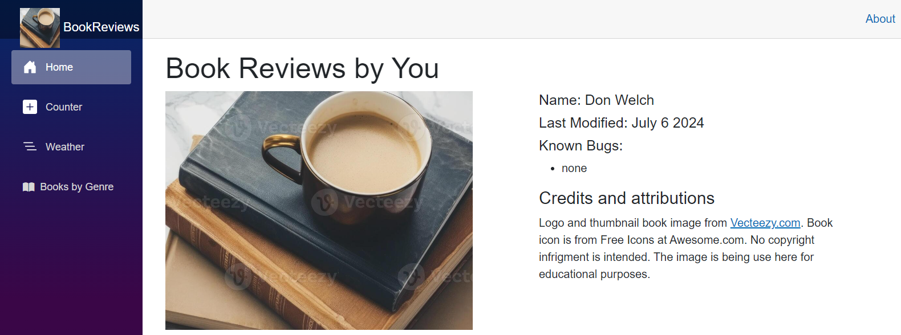
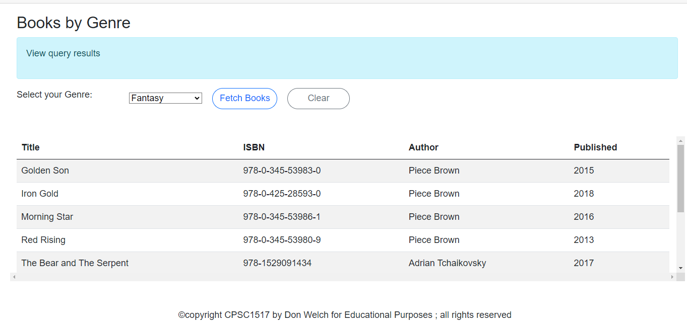

# Book Reviews - Ex04 - Database Querying Based on Filters

> In this exercises you will be creating a website to query information on book reviews demonstrating Client/Server techniques using data from a database
> . **BookReviews** is a web application for those who want to keep information on book reviews. To start application development, we will limit the data to maintain in a database to authors, books, genres, ratings and reviews.
>

## Overview

A key aspect of the site is to allow users to search the database to find information on various books by genre. Your task in this assignment is to provide that functionality.

Use the demos presented in class as a guide to implementing this exercise.

### Database setup

Use the supplied database found in this repository: `eBooks.bacpac`. Restore this database to your machine. You will be using this database in this exercise.

### Client Service Web Application

1. Create a .Net Core 8 Blazor web server application project called `BookReviews` (solution name of your choice).**Turn off the Configure for HTTPS check box.** This project will reference  your class library. Add the necessary NuGet packages to handle data from a MS SQL database. Include the sample pages. You may use images from Exercise 3.
2. Change the home page (sample below) to include your name, known bugs and last date modified. If you are using images that are not sourced by you, add a Credits and attributions note.



### Client Service Application class library using a database

1. Create a .Net Core 8 class library project called `BookSystemDB`. Create 3 subfolders within this project based on the structure used in class: BLL, DAL, and Entities. Use reverse engineering and the supplied database to create the Entity classes and DAL context class. It is ***strongly*** advised that you review the class demonstration for this process. Make the context class internal. Add a project reference to your web application for this class library. Add the necessary NuGet packages to handle data from a MS SQL database. Add a NotMapped anontation to your Author entity to return the author full name.


2. Create your database connection string in the appsettings.json file.

```csharp
"ConnectionStrings": {
    "BookDB" : "Server=xxxx;Database=eBooks;Trusted_Connection=true;MultipleActiveResultSets=true"
  }
```

3. Setup the service dependency registration for the web application and library class. Use your class lesson demonstration to complete this process. Use an extension class to register the connections string and services within your class library.

### Overview Web Application Functionality and Requirements

Create an `Query.razor`/`Query.razor.cs` Blazor Page. The partial code class must inject the dependency on the `GenreServices`, `AuthorServices` and `BookServices` classes. Details of your display can be found below. Be sure to add a menu item so that this page can be navigated to using the main menu. Add an appropriate title to the page and the title browser tab.

### Book System: BLL service classes

**GenreServices**

Create a new service class called `GenreServices` in your BLL folder. This class will contain one service method to return the complete list of Genres. This query list will be sorted alphabetically by Description. Remember to register your service class.

**AuthorServices**

Create a new service class called `AuthorServices` in your BLL folder. This class will contain one service method to return the complete list of Authors. Remember to register your service class.

**BookServices**

Create a new service class called `BookServices` in your BLL folder. This class will contain one service method to return the complete list of books for a specified genre ordered bt Title. The method will receive a filtering parameter for a specified genre. Remember to register your service class.

### Query Page to search Books needed for a specific Genre

The `Query.razor` page will display information on the supply data in an HTML table. Display the `Book Title`, `ISBN`, `Author full name` and `Year Published` information. This query page will have Drop Down List filter showing the Genre description. The page will have two buttons: Search and Clear. Each button will require an event handler. Place the page coding in a separate file called `Query.razor.cs`. Demonstrate either paging or table scrolling by limiting your display to 5 lines at a time. Display a message if no books have been found for the selected genre.

Only present the data (sample) as shown below:




To ensure that your web application works, build and run your project.

## Evaluation

> ***NOTE:** Your code **must** compile. Solutions that do not compile will receive an automatic mark of zero (0).*
>
> If you are unable to get a portion of the assignment to compile, you should:
>
> - Comment out the non-compiling portion of code
> - Identify the non-compiling portion in the **Incomplete Requirements** heading, noting the item's
>   - File name (e.g.: "Account.cs")
>   - Line number(s)
>   - Compiler error number and general message

Your assignment will be marked based upon the following weights.

| Earned | Weight | Deliverable/Requirement | Comments |
| ------ | ---- | --------- |   ------- |
|  | 1 | Create appropriate ASP.NET Core Class Blazozr web server application (.net core 8) |   |
|  | 1 | Create appropriate ASP.NET Core Class Library (.net core 8) |   |
|  | 1 | Create Entity classes using reverse engineering (Entity and DAL classes) |    |
|  | 2 | Setup project references, necessary NuGet packages, and service registration code |   |
|  | 1 | Alter home page and add menu item for Query page access. |    |
|  | 1 | `GenreServices.cs` BLL service class|   |
|  | 1 | `AuthorServices.cs` BLL service class|   |
|  | 2 | `SupplyServices.cs` BLL service class |    |
|  | 3 | `Query.razor` setup appropriate controls for query agrument (Job) and table display (Books) |   |
|  | 3 | `Query.razor.cs` Write appropriate code/post events to handle necessary bind properties, OnInitialize, and query button. |   |
|  | 1 | `Query.razor.cs` Write appropriate post event to clear the page |   |
|  | 1 | User friendly error handling: consistent throughout all post events, able to handle a collection of errors   |   |
|   | -4 max | **Penalty** -  Such as but not limited to: missing incremental commits; compile errors; incorrect project types; code separation | |   |
| ------ | ---- | --------- |  -----|
|  | **18** | **Total Weight** |   |

----

## Additional Comments

----

[Return to exercises](../README.md)
